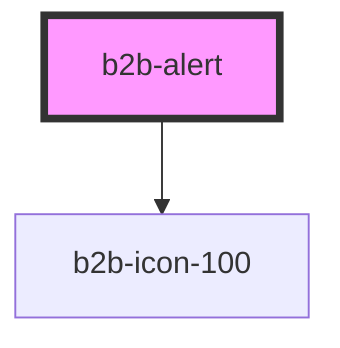

# b2b-alert

<!-- Auto Generated Below -->

## Properties

| Property         | Attribute          | Description                                                                                                              | Type                                          | Default   |
| ---------------- | ------------------ | ------------------------------------------------------------------------------------------------------------------------ | --------------------------------------------- | --------- |
| `customIcon`     | `custom-icon`      | Whether or not you want to use a custom icon. Per default, it is false.                                                  | `boolean`                                     | `false`   |
| `hasCloseButton` | `has-close-button` | Whether or not the alert has a close button. Per default it is true. Note that errors and small alerts cannot be closed. | `boolean`                                     | `true`    |
| `opened`         | `opened`           | Whether the alert is currently open. Set to true to display the alert.                                                   | `boolean`                                     | `false`   |
| `size`           | `size`             | The size of the alert. Per default it is large. If set to small, the alert will only have an icon.                       | `"large" \| "small"`                          | `'large'` |
| `type`           | `type`             | The type of alert. Per default it is info.                                                                               | `"error" \| "info" \| "success" \| "warning"` | `'info'`  |

## Events

| Event       | Description                         | Type                |
| ----------- | ----------------------------------- | ------------------- |
| `b2b-close` | Emits whenever the alert is closed. | `CustomEvent<void>` |

## Dependencies

### Depends on

- [b2b-icon-100](../icon-100)

### Graph

----------------------------------------------

*Built with [StencilJS](https://stenciljs.com/)*
