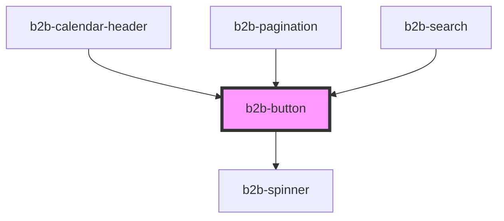

# b2b-button

<!-- Auto Generated Below -->

## Properties

| Property   | Attribute  | Description                                                                                                                                                                           | Type                                           | Default         |
| ---------- | ---------- | ------------------------------------------------------------------------------------------------------------------------------------------------------------------------------------- | ---------------------------------------------- | --------------- |
| `active`   | `active`   | Whether the button is currently active. Set to true when using the button to signify a permanent active state                                                                         | `boolean`                                      | `false`         |
| `disabled` | `disabled` | Whether the button is disabled.                                                                                                                                                       | `boolean`                                      | `false`         |
| `download` | `download` | If set to true, the browser will attempt to donwload and save the URL instead of opening it. The name of the created file defaults to the URL string, but can be changed by the user. | `string`                                       | `undefined`     |
| `href`     | `href`     | An optional anchor. If specified, the button will render an anchor element that can be use for navigation or download files                                                           | `string`                                       | `undefined`     |
| `loading`  | `loading`  | Whether the button is currently loading. Set to true to hide text and display loading spinner instead                                                                                 | `boolean`                                      | `false`         |
| `size`     | `size`     | The size of the button, 100 is the default state                                                                                                                                      | `"100" \| "50"`                                | `'100'`         |
| `target`   | `target`   | The target of the button if it should behave like an anchor. Per default it is self.                                                                                                  | `"blank" \| "self"`                            | `'self'`        |
| `type`     | `type`     | The button type. Matches native HTML types. The default type is 'button'.                                                                                                             | `"button" \| "reset" \| "submit"`              | `'button'`      |
| `variant`  | `variant`  | The button variant. If not specified, the button will be the secondary variant.                                                                                                       | `"primary" \| "secondary"`                     | `'secondary'`   |
| `width`    | `width`    | The width of the button. Per default, it will fit the content                                                                                                                         | `"custom" \| "fit-container" \| "fit-content"` | `'fit-content'` |

## Methods

### `setFocus() => Promise<void>`

Manually set focus to button element

#### Returns

Type: `Promise<void>`

## Dependencies

### Used by

 - [b2b-calendar-header](../calendar)
 - [b2b-pagination](../pagination)
 - [b2b-search](../search)

### Depends on

- [b2b-spinner](../spinner)

### Graph

----------------------------------------------

*Built with [StencilJS](https://stenciljs.com/)*
