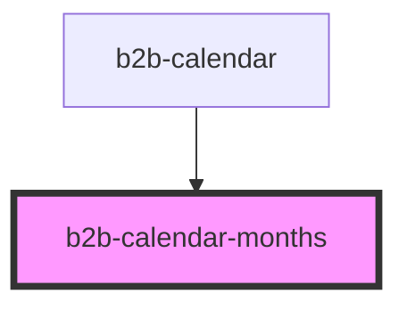

# b2b-calendar

<!-- Auto Generated Below -->

## Properties

| Property        | Attribute        | Description             | Type     | Default     |
| --------------- | ---------------- | ----------------------- | -------- | ----------- |
| `selectedMonth` | `selected-month` | Internal selected month | `number` | `undefined` |

## Events

| Event                         | Description                       | Type                                    |
| ----------------------------- | --------------------------------- | --------------------------------------- |
| `b2b-calendar-month-selected` | Event emitted on selecting month* | `CustomEvent<MonthSelectedEventDetail>` |

## Dependencies

### Used by

 - [b2b-calendar](.)

### Graph

----------------------------------------------

*Built with [StencilJS](https://stenciljs.com/)*
