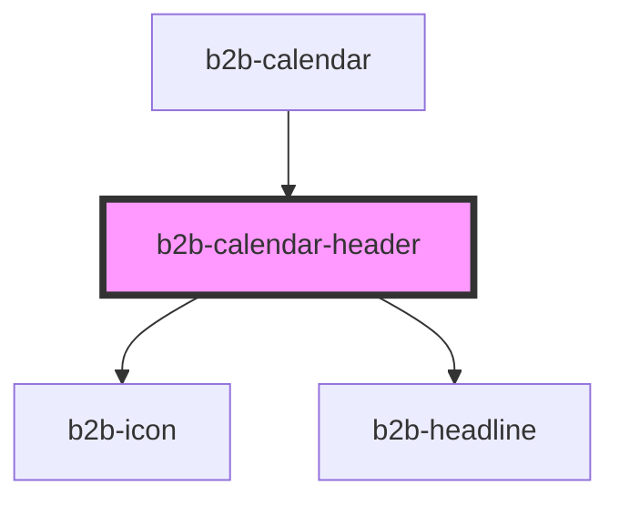

# b2b-calendar

<!-- Auto Generated Below -->

## Properties

| Property            | Attribute        | Description                    | Type         | Default     |
| ------------------- | ---------------- | ------------------------------ | ------------ | ----------- |
| `onLeftArrowClick`  | --               | Callback for left arrow click  | `() => void` | `undefined` |
| `onRightArrowClick` | --               | Callback for right arrow click | `() => void` | `undefined` |
| `selectedMonth`     | `selected-month` | Internal selected month        | `number`     | `undefined` |
| `selectedYear`      | `selected-year`  | Internal selected year         | `number`     | `undefined` |

## Dependencies

### Used by

 - [b2b-calendar](.)

### Depends on

- [b2b-icon](../icon)
- [b2b-headline](../headline)

### Graph

----------------------------------------------

*Built with [StencilJS](https://stenciljs.com/)*
