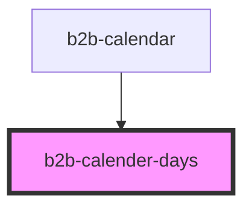

# b2b-calendar

<!-- Auto Generated Below -->

## Properties

| Property             | Attribute              | Description | Type                    | Default     |
| -------------------- | ---------------------- | ----------- | ----------------------- | ----------- |
| `disableFutureDates` | `disable-future-dates` |             | `boolean`               | `false`     |
| `disablePastDates`   | `disable-past-dates`   |             | `boolean`               | `false`     |
| `disableWeekends`    | `disable-weekends`     |             | `boolean`               | `false`     |
| `selectedMonth`      | `selected-month`       |             | `number`                | `undefined` |
| `selectedYear`       | `selected-year`        |             | `number`                | `undefined` |
| `setCurrentDay`      | --                     |             | `(day: number) => void` | `undefined` |

## Dependencies

### Used by

 - [b2b-calendar](.)

### Graph

----------------------------------------------

*Built with [StencilJS](https://stenciljs.com/)*
