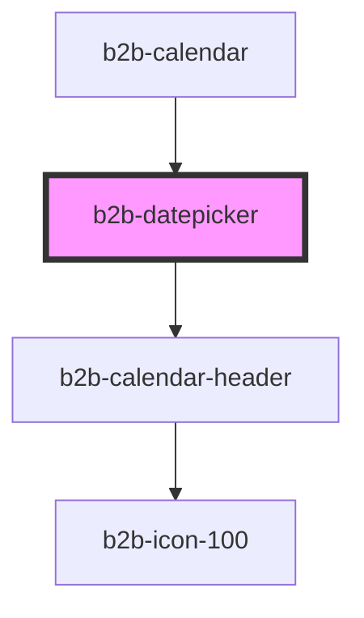

# b2b-calendar

<!-- Auto Generated Below -->

## Properties

| Property             | Attribute              | Description | Type      | Default |
| -------------------- | ---------------------- | ----------- | --------- | ------- |
| `disableFutureDates` | `disable-future-dates` |             | `boolean` | `false` |
| `disablePastDates`   | `disable-past-dates`   |             | `boolean` | `true`  |
| `disableWeekends`    | `disable-weekends`     |             | `boolean` | `false` |

## Events

| Event          | Description | Type                                    |
| -------------- | ----------- | --------------------------------------- |
| `b2b-selected` |             | `CustomEvent<CalendarEventDetail<any>>` |

## Dependencies

### Used by

 - [b2b-calendar](.)

### Depends on

- [b2b-calendar-header](.)

### Graph

----------------------------------------------

*Built with [StencilJS](https://stenciljs.com/)*
