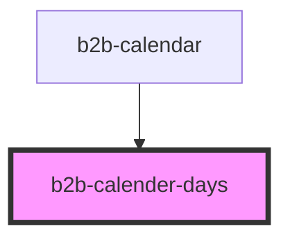

# b2b-calendar

<!-- Auto Generated Below -->

## Properties

| Property             | Attribute              | Description                                                                                     | Type      | Default     |
| -------------------- | ---------------------- | ----------------------------------------------------------------------------------------------- | --------- | ----------- |
| `disableFutureDates` | `disable-future-dates` | Internal whether the dates after the current date are disabled. By default, this is false.      | `boolean` | `false`     |
| `disablePastDates`   | `disable-past-dates`   | Internal whether the dates previous to the current date are disabled. By default, this is true. | `boolean` | `false`     |
| `disableWeekends`    | `disable-weekends`     | Internal whether the weekends are disabled. By default, this is false.                          | `boolean` | `false`     |
| `selectedDay`        | `selected-day`         | Internal selected day                                                                           | `number`  | `undefined` |
| `selectedMonth`      | `selected-month`       | Internal selected month                                                                         | `number`  | `undefined` |
| `selectedYear`       | `selected-year`        | Internal selected year                                                                          | `number`  | `undefined` |

## Events

| Event                 | Description | Type                                   |
| --------------------- | ----------- | -------------------------------------- |
| `b2b-calender-escape` |             | `CustomEvent<EscapePressed<any>>`      |
| `b2b-date-selected`   |             | `CustomEvent<DateSelectedEventDetail>` |

## Dependencies

### Used by

 - [b2b-calendar](.)

### Graph

----------------------------------------------

*Built with [StencilJS](https://stenciljs.com/)*
