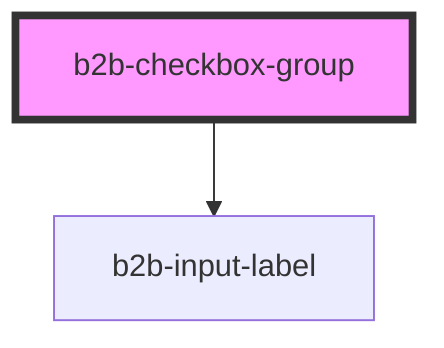

# b2b-checkbox-group

<!-- Auto Generated Below -->

## Properties

| Property    | Attribute   | Description                                                                                    | Type                         | Default      |
| ----------- | ----------- | ---------------------------------------------------------------------------------------------- | ---------------------------- | ------------ |
| `alignment` | `alignment` | The alignment of the checkbox group. Per default it is vertical                                | `"horizontal" \| "vertical"` | `'vertical'` |
| `disabled`  | `disabled`  | Whether or not the checkbox group as a whole is disabled. Default state is false.              | `boolean`                    | `false`      |
| `error`     | `error`     | The checkbox group error message. Is displayed when invalid is set to true.                    | `string`                     | `undefined`  |
| `hint`      | `hint`      | The checkbox group hint text.                                                                  | `string`                     | `undefined`  |
| `invalid`   | `invalid`   | Whether or not the checkbox group as a whole is invalid. Set to true to display a group error. | `boolean`                    | `false`      |
| `label`     | `label`     | The label for the checkbox group. This is optional.                                            | `string`                     | `undefined`  |
| `required`  | `required`  | Adds an asterisk at the end of the label to signify that the field is required.                | `boolean`                    | `false`      |

## Events

| Event              | Description                                                         | Type                                    |
| ------------------ | ------------------------------------------------------------------- | --------------------------------------- |
| `b2b-group-change` | Emits whenever a checkbox within the group is checked or unchecked. | `CustomEvent<CheckboxEventDetail<any>>` |

## Dependencies

### Depends on

- [b2b-input-label](../input-label)

### Graph

----------------------------------------------

*Built with [StencilJS](https://stenciljs.com/)*
