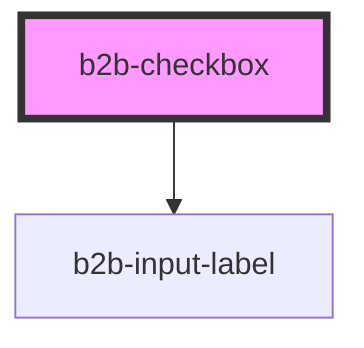

# b2b-checkbox

<!-- Auto Generated Below -->

## Properties

| Property             | Attribute  | Description                                                                                                                                 | Type      | Default     |
| -------------------- | ---------- | ------------------------------------------------------------------------------------------------------------------------------------------- | --------- | ----------- |
| `checked`            | `checked`  | Whether or not the checkbox is checked. Default value is false and can be set to true if the checkbox should come pre-checked.              | `boolean` | `false`     |
| `disabled`           | `disabled` | Whether or not the checkbox is disabled. The default value is false.                                                                        | `boolean` | `false`     |
| `error`              | `error`    | The error message. It is undefined by default. If a string is passed in, it will render the checkbox with error styles.                     | `string`  | `undefined` |
| `hint`               | `hint`     | The hint text belonging to the checkbox. It is undefined by default. If an error is specified, it will be shown instead of the hint.        | `string`  | `undefined` |
| `invalid`            | `invalid`  | Whether or not the checkbox is rendered with error styles. Defaults to false.                                                               | `boolean` | `false`     |
| `label` _(required)_ | `label`    | The checkbox label. This attribute is required.                                                                                             | `string`  | `undefined` |
| `name`               | `name`     | The name of the checkbox. Per default it is undefined. Use this to programmatically group checkboxes together by giving them the same name. | `string`  | `undefined` |
| `required`           | `required` | Adds an asterisk at the end of the label to signify that the field is required.                                                             | `boolean` | `false`     |
| `value`              | `value`    | The value of the checkbox. This is not the same as the checked property. It is only used when the checkbox participates in a checkbox group | `any`     | `undefined` |

## Events

| Event        | Description                                                | Type                                    |
| ------------ | ---------------------------------------------------------- | --------------------------------------- |
| `b2b-blur`   | Emits whenever the checkbox loses focus.                   | `CustomEvent<FocusEvent>`               |
| `b2b-change` | Emits the checkbox value when it's checked status changes. | `CustomEvent<CheckboxEventDetail<any>>` |
| `b2b-focus`  | Emits whenever the checkbox receives focus.                | `CustomEvent<FocusEvent>`               |

## Dependencies

### Depends on

- [b2b-input-label](../input-label)

### Graph

----------------------------------------------

*Built with [StencilJS](https://stenciljs.com/)*
