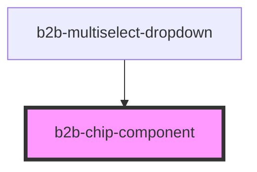

# b2b-chip-component

<!-- Auto Generated Below -->

## Properties

| Property             | Attribute          | Description                                                                   | Type      | Default     |
| -------------------- | ------------------ | ----------------------------------------------------------------------------- | --------- | ----------- |
| `disabled`           | `disabled`         | Whether the chip is disabled.                                                 | `boolean` | `false`     |
| `hasCloseButton`     | `has-close-button` | Whether or not the chip component has a close button. Per default it is true. | `boolean` | `true`      |
| `label` _(required)_ | `label`            | The text content of the chip. It is required.                                 | `string`  | `undefined` |
| `value`              | `value`            | It is only used when the chip component participates in a group               | `any`     | `undefined` |

## Events

| Event       | Description                                                  | Type                                         |
| ----------- | ------------------------------------------------------------ | -------------------------------------------- |
| `b2b-close` | This event will be triggered when the chip element is closed | `CustomEvent<ChipComponentEventDetail<any>>` |

## Dependencies

### Used by

 - [b2b-multiselect-dropdown](../multiselect-dropdown)

### Graph

----------------------------------------------

*Built with [StencilJS](https://stenciljs.com/)*
