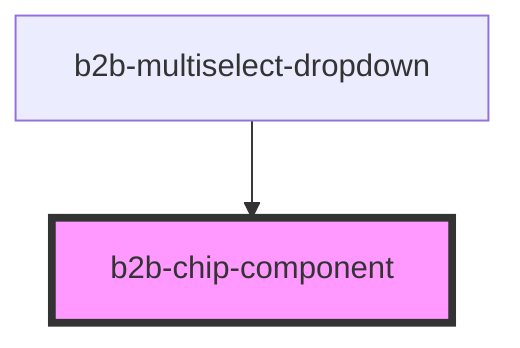

# b2b-chip-component

<!-- Auto Generated Below -->

## Properties

| Property             | Attribute          | Description                                                                                                                       | Type                                                   | Default     |
| -------------------- | ------------------ | --------------------------------------------------------------------------------------------------------------------------------- | ------------------------------------------------------ | ----------- |
| `disabled`           | `disabled`         | Whether the chip is disabled.                                                                                                     | `boolean`                                              | `false`     |
| `hasCloseButton`     | `has-close-button` | Whether or not the chip component has a close button. Per default it is true.                                                     | `boolean`                                              | `true`      |
| `label` _(required)_ | `label`            | The text content of the chip. It is required.                                                                                     | `string`                                               | `undefined` |
| `labelStyle`         | `label-style`      | The style of the label which decorates the text in bold, italic, underline or strikethrough style. Uses default style if not set. | `"bold" \| "italic" \| "strikethrough" \| "underline"` | `undefined` |
| `type`               | `type`             | The type of chip to represent states like success, info, warn and error. Uses default style if not set.                           | `"error" \| "info" \| "success" \| "warn"`             | `undefined` |
| `value`              | `value`            | It is only used when the chip component participates in a group                                                                   | `any`                                                  | `undefined` |

## Events

| Event       | Description                                                  | Type                                         |
| ----------- | ------------------------------------------------------------ | -------------------------------------------- |
| `b2b-close` | This event will be triggered when the chip element is closed | `CustomEvent<ChipComponentEventDetail<any>>` |

## Dependencies

### Used by

 - [b2b-multiselect-dropdown](../multiselect-dropdown)

### Graph

----------------------------------------------

*Built with [StencilJS](https://stenciljs.com/)*
