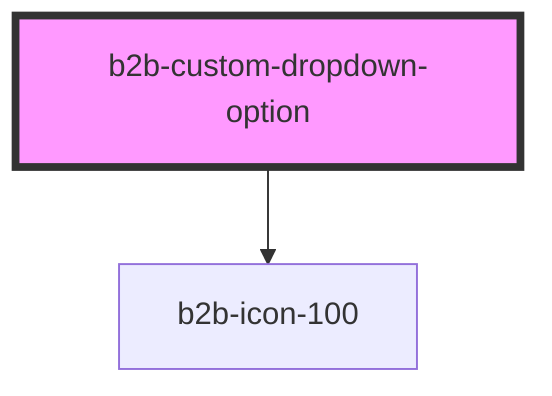

# b2b-custom-dropdown

<!-- Auto Generated Below -->

## Properties

| Property              | Attribute             | Description                                                                                                  | Type      | Default                 |
| --------------------- | --------------------- | ------------------------------------------------------------------------------------------------------------ | --------- | ----------------------- |
| `disabled`            | `disabled`            | Whether the option is disabled. Per default it is false. If disabled is true, the option cannot be selected. | `boolean` | `false`                 |
| `hoverIcon`           | `hover-icon`          | The icon to display when the option is hovered and not selected. Defaults to null (no icon).                 | `any`     | `null`                  |
| `hoverIconColor`      | `hover-icon-color`    | The color of the icon when the option is hovered. Defaults to 'b2b-color-black-100'.                         | `string`  | `'b2b-color-black-100'` |
| `option` _(required)_ | `option`              | The option name.                                                                                             | `string`  | `undefined`             |
| `selected`            | `selected`            | Whether the option is currently selected.                                                                    | `boolean` | `false`                 |
| `selectedIcon`        | `selected-icon`       | The icon to display when the option is selected. Defaults to null (no icon).                                 | `any`     | `null`                  |
| `selectedIconColor`   | `selected-icon-color` | The color of the icon when the option is selected. Defaults to 'b2b-color-black-100'.                        | `string`  | `'b2b-color-black-100'` |
| `separator`           | `separator`           | Whether the option has a separator at the bottom. Per default it is false.                                   | `boolean` | `false`                 |

## Events

| Event                                 | Description                                                  | Type                                          |
| ------------------------------------- | ------------------------------------------------------------ | --------------------------------------------- |
| `b2b-custom-dropdown-option-selected` | Emits the option as a string whenever an option is selected. | `CustomEvent<OptionSelectedEventDetail<any>>` |

## Dependencies

### Depends on

- [b2b-icon-100](../icon-100)

### Graph

----------------------------------------------

*Built with [StencilJS](https://stenciljs.com/)*
