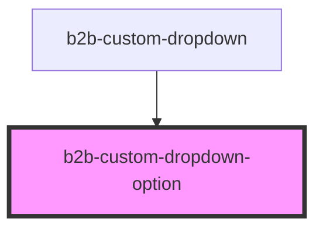

# b2b-custom-dropdown

<!-- Auto Generated Below -->

## Properties

| Property              | Attribute   | Description                                                                                                  | Type      | Default     |
| --------------------- | ----------- | ------------------------------------------------------------------------------------------------------------ | --------- | ----------- |
| `disabled`            | `disabled`  | Whether the option is disabled. Per default it is false. If disabled is true, the option cannot be selected. | `boolean` | `false`     |
| `option` _(required)_ | `option`    | The option name.                                                                                             | `string`  | `undefined` |
| `selected`            | `selected`  | Whether the option is currently selected.                                                                    | `boolean` | `false`     |
| `separator`           | `separator` | Whether the option has a separator at the bottom. Per default it is false.                                   | `boolean` | `false`     |

## Events

| Event                                 | Description                                                  | Type                                          |
| ------------------------------------- | ------------------------------------------------------------ | --------------------------------------------- |
| `b2b-custom-dropdown-option-selected` | Emits the option as a string whenever an option is selected. | `CustomEvent<OptionSelectedEventDetail<any>>` |

## Dependencies

### Used by

 - [b2b-custom-dropdown](.)

### Graph

----------------------------------------------

*Built with [StencilJS](https://stenciljs.com/)*
