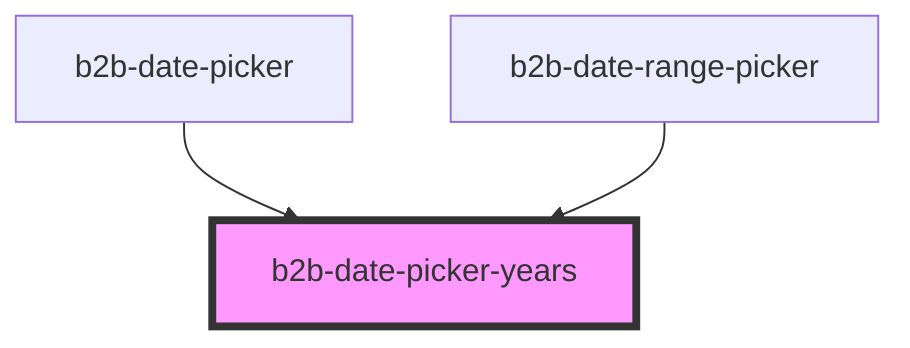

# b2b-date-picker

<!-- Auto Generated Below -->

## Properties

| Property       | Attribute       | Description            | Type     | Default     |
| -------------- | --------------- | ---------------------- | -------- | ----------- |
| `selectedYear` | `selected-year` | Internal selected year | `number` | `undefined` |

## Events

| Event                           | Description                     | Type                                           |
| ------------------------------- | ------------------------------- | ---------------------------------------------- |
| `b2b-date-picker-escape`        | Event emitted on escape press   | `CustomEvent<EscapePressed<any>>`              |
| `b2b-date-picker-year-selected` | Event emitted on selecting year | `CustomEvent<YearSelectedEventDetail<number>>` |

## Dependencies

### Used by

 - [b2b-date-picker](.)
 - [b2b-date-range-picker](../date-range-picker)

### Graph

----------------------------------------------

*Built with [StencilJS](https://stenciljs.com/)*
