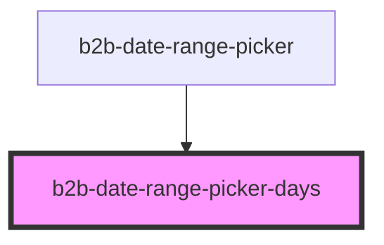

# b2b-date-range-picker-days

<!-- Auto Generated Below -->

## Properties

| Property       | Attribute     | Description                                                                                                                                                                                                        | Type                                                  | Default       |
| -------------- | ------------- | ------------------------------------------------------------------------------------------------------------------------------------------------------------------------------------------------------------------ | ----------------------------------------------------- | ------------- |
| `disableDates` | --            | Function used to determine, whether a day should be disabled e.g. because it is in the past. This is only used for the start and end dates, it is valid to have a disabled day in the range of start and end date. | `(day: number) => boolean`                            | `() => false` |
| `firstDate`    | `first-date`  | The first date of the selection. This may be absent if no dates have been selected yet. This is always smaller/earlier than the second date.                                                                       | `Date \| readonly [number, number, number] \| string` | `undefined`   |
| `preview`      | `preview`     | Whether the shown values are a preview and not the actual values (force-hover state).                                                                                                                              | `boolean`                                             | `false`       |
| `secondDate`   | `second-date` | The second date of the selection. This may be absent if none or only one date has been selected yet. This is always bigger/later than the first date.                                                              | `Date \| readonly [number, number, number] \| string` | `undefined`   |
| `viewedDate`   | `viewed-date` | The currently shown date (year+month).                                                                                                                                                                             | `Date \| readonly [number, number, number] \| string` | `new Date()`  |

## Events

| Event                    | Description                      | Type                                   |
| ------------------------ | -------------------------------- | -------------------------------------- |
| `b2b-date-picker-escape` | Event emitted on escape press.   | `CustomEvent<EscapePressed<any>>`      |
| `b2b-date-selected`      | Event emitted on selecting date. | `CustomEvent<DateSelectedEventDetail>` |

## Dependencies

### Used by

 - [b2b-date-range-picker](.)

### Graph

----------------------------------------------

*Built with [StencilJS](https://stenciljs.com/)*
