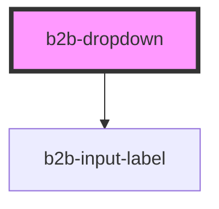

# b2b-dropdown

<!-- Auto Generated Below -->

## Properties

| Property   | Attribute  | Description                                                                                                             | Type      | Default     |
| ---------- | ---------- | ----------------------------------------------------------------------------------------------------------------------- | --------- | ----------- |
| `disabled` | `disabled` | Whether the select as a whole is disabled. Per default it is false.                                                     | `boolean` | `false`     |
| `error`    | `error`    | An optional error message for the dropdown. This will only appear if invalid is set to true.                            | `string`  | `undefined` |
| `hint`     | `hint`     | An optional hint text for the dropdown.                                                                                 | `string`  | `undefined` |
| `invalid`  | `invalid`  | Whether the select is currently invalid. Per default it is false.                                                       | `boolean` | `false`     |
| `label`    | `label`    | The dropdown label.                                                                                                     | `string`  | `undefined` |
| `name`     | `name`     | The name of the select. This is used to associate the label to the dropdown element. It is important for accessibility. | `string`  | `undefined` |
| `required` | `required` | Adds an asterisk at the end of the label to signify that the field is required.                                         | `boolean` | `false`     |

## Events

| Event        | Description                                       | Type                      |
| ------------ | ------------------------------------------------- | ------------------------- |
| `b2b-blur`   | Emits whenever the dropdown loses focus.          | `CustomEvent<FocusEvent>` |
| `b2b-change` | Emits the option whenever a new option is chosen. | `CustomEvent<string>`     |
| `b2b-focus`  | Emits whenever the dropdown receives focus.       | `CustomEvent<FocusEvent>` |

## Dependencies

### Depends on

- [b2b-input-label](../input-label)

### Graph

----------------------------------------------

*Built with [StencilJS](https://stenciljs.com/)*
