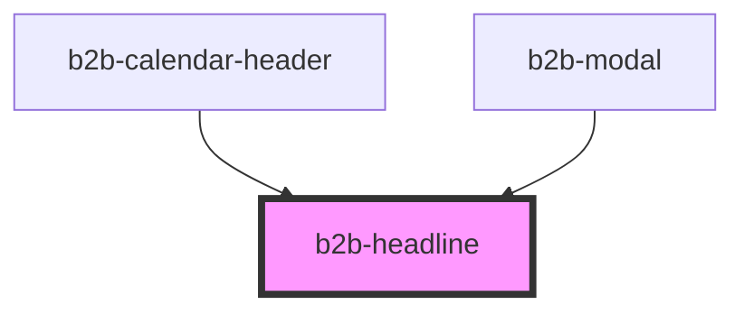

# b2b-headline

<!-- Auto Generated Below -->

## Overview

Headline component to render hading tags content.
Initial story: https://otto-eg.atlassian.net/browse/B2BDS-46

## Properties

| Property   | Attribute   | Description                                                                                                                               | Type                            | Default  |
| ---------- | ----------- | ----------------------------------------------------------------------------------------------------------------------------------------- | ------------------------------- | -------- |
| `align`    | `align`     | The alignment of the headline.                                                                                                            | `"center" \| "left" \| "right"` | `'left'` |
| `noMargin` | `no-margin` | Whether the headline should have a margin. Per default, margins are enabled.                                                              | `boolean`                       | `false`  |
| `size`     | `size`      | Each variant has a different hierarchical order, where 1 is the highest level. 400 will render to `<h1>`, 200 to `<h2>` and 100 to `<h3>` | `"100" \| "200" \| "400"`       | `'400'`  |

## Dependencies

### Used by

 - [b2b-calendar-header](../calendar)
 - [b2b-modal](../modal)

### Graph

----------------------------------------------

*Built with [StencilJS](https://stenciljs.com/)*
