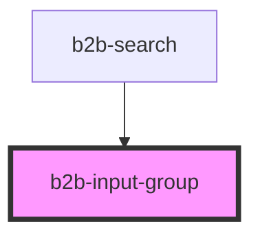

# b2b-input-wrapper

<!-- Auto Generated Below -->

## Properties

| Property   | Attribute  | Description                                                                                                             | Type      | Default     |
| ---------- | ---------- | ----------------------------------------------------------------------------------------------------------------------- | --------- | ----------- |
| `disabled` | `disabled` | Whether or not the input group is disabled as a whole. Per default it is false.                                         | `boolean` | `false`     |
| `error`    | `error`    | A group error text. It will only show if invalid is set to true.                                                        | `string`  | `undefined` |
| `hint`     | `hint`     | The hint text that appears underneath the input group.                                                                  | `string`  | `undefined` |
| `invalid`  | `invalid`  | Whether or not the input group is invalid and should be rendered with error styles as a whole. Per default it is false. | `boolean` | `false`     |

## Dependencies

### Used by

 - [b2b-search](../search)

### Graph

----------------------------------------------

*Built with [StencilJS](https://stenciljs.com/)*
