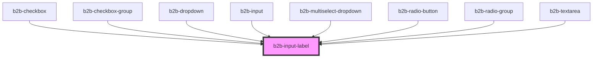

# b2b-input-label

<!-- Auto Generated Below -->

## Properties

| Property   | Attribute  | Description                                                                     | Type      | Default |
| ---------- | ---------- | ------------------------------------------------------------------------------- | --------- | ------- |
| `disabled` | `disabled` | Will render the label with a disabled style. The default value is false.        | `boolean` | `false` |
| `required` | `required` | Adds an asterisk at the end of the label to signify that the field is required. | `boolean` | `false` |

## Dependencies

### Used by

 - [b2b-checkbox](../checkbox)
 - [b2b-checkbox-group](../checkbox-group)
 - [b2b-dropdown](../dropdown)
 - [b2b-input](../input)
 - [b2b-multiselect-dropdown](../multiselect-dropdown)
 - [b2b-radio-button](../radio)
 - [b2b-radio-group](../radio-group)
 - [b2b-textarea](../textarea)

### Graph

----------------------------------------------

*Built with [StencilJS](https://stenciljs.com/)*
