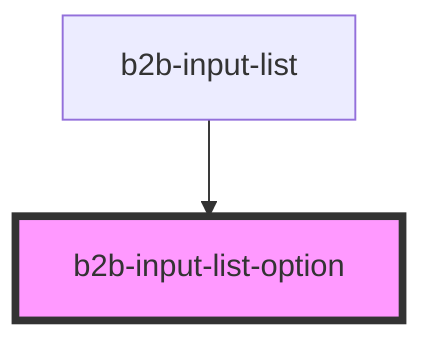

# b2b-input-list-option

<!-- Auto Generated Below -->

## Properties

| Property | Attribute | Description      | Type     | Default     |
| -------- | --------- | ---------------- | -------- | ----------- |
| `option` | `option`  | The option name. | `string` | `undefined` |

## Events

| Event                 | Description                                                  | Type                                          |
| --------------------- | ------------------------------------------------------------ | --------------------------------------------- |
| `b2b-option-selected` | Emits the option as a string whenever an option is selected. | `CustomEvent<OptionSelectedEventDetail<any>>` |

## Dependencies

### Used by

 - [b2b-input-list](.)

### Graph

----------------------------------------------

*Built with [StencilJS](https://stenciljs.com/)*
