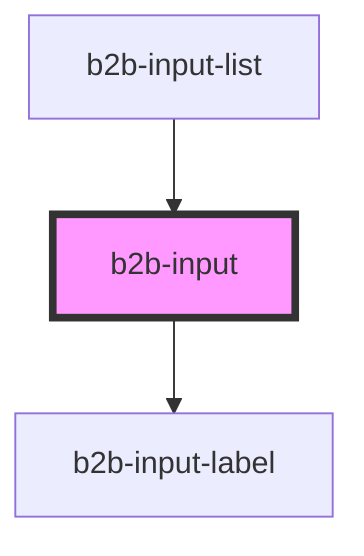

# b2b-input

<!-- Auto Generated Below -->

## Overview

Input component
Initial story: https://otto-eg.atlassian.net/browse/B2BDS-53

## Properties

| Property         | Attribute          | Description                                                                                                        | Type                                                                        | Default     |
| ---------------- | ------------------ | ------------------------------------------------------------------------------------------------------------------ | --------------------------------------------------------------------------- | ----------- |
| `autofocus`      | `autofocus`        | When setting the autofocus to true, the input element will be focused when the page loads.                         | `boolean`                                                                   | `false`     |
| `disabled`       | `disabled`         | Whether or not the input is disabled. Default is false.                                                            | `boolean`                                                                   | `false`     |
| `error`          | `error`            | The error message that is shown if the input is invalid.                                                           | `string`                                                                    | `undefined` |
| `hint`           | `hint`             | The hint text that appears underneath the input field.                                                             | `string`                                                                    | `undefined` |
| `inputTextAlign` | `input-text-align` | The alignment of the text.                                                                                         | `"center" \| "left" \| "right"`                                             | `'left'`    |
| `invalid`        | `invalid`          | Whether the input is currently invalid. If true, the input is rendered with error styles. Per default it is false. | `boolean`                                                                   | `false`     |
| `label`          | `label`            | The input label.                                                                                                   | `string`                                                                    | `undefined` |
| `name`           | `name`             | The name of the input. Use it to group label and input together and make it more accessible.                       | `string`                                                                    | `undefined` |
| `placeholder`    | `placeholder`      | A placeholder for the input field. Per default, it is null.                                                        | `string`                                                                    | `null`      |
| `required`       | `required`         | Adds an asterisk at the end of the label to signify that the field is required.                                    | `boolean`                                                                   | `false`     |
| `type`           | `type`             | The type of the input. All native HTML types except date or month are supported. Default is text.                  | `"email" \| "number" \| "password" \| "search" \| "tel" \| "text" \| "url"` | `'text'`    |
| `value`          | `value`            | The default value of the input field. If defined, it will prefill the input.                                       | `string`                                                                    | `null`      |

## Events

| Event       | Description                              | Type                            |
| ----------- | ---------------------------------------- | ------------------------------- |
| `b2b-blur`  | Emits whenever the input loses focus.    | `CustomEvent<FocusEvent>`       |
| `b2b-focus` | Emits whenever the input receives focus. | `CustomEvent<FocusEvent>`       |
| `b2b-input` | Emits whenever the input value changes.  | `CustomEvent<InputChangeEvent>` |

## Methods

### `clearInput() => Promise<void>`

Simulate the native behavior of type="search" to emit an empty string when the input is cleared

#### Returns

Type: `Promise<void>`

### `setFocus() => Promise<void>`

Manually set focus to the element

#### Returns

Type: `Promise<void>`

## Dependencies

### Used by

 - [b2b-input-list](../input-list)

### Depends on

- [b2b-input-label](../input-label)

### Graph

----------------------------------------------

*Built with [StencilJS](https://stenciljs.com/)*
