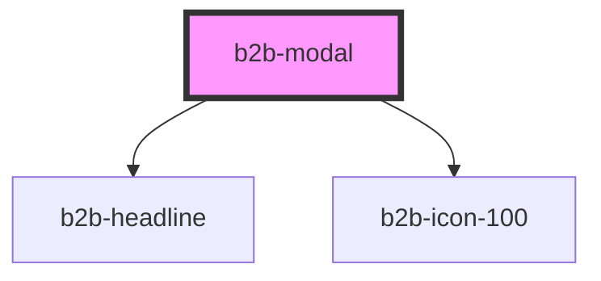

# b2b-modal

<!-- Auto Generated Below -->

## Overview

Modal component
Initial story: https://otto-eg.atlassian.net/browse/B2BDS-53

## Properties

| Property               | Attribute          | Description                                                                                                | Type                   | Default     |
| ---------------------- | ------------------ | ---------------------------------------------------------------------------------------------------------- | ---------------------- | ----------- |
| `backdropDismiss`      | `backdrop-dismiss` | A boolean that indicates whether the modal can be dismissed by clicking in the backdrop outside the modal. | `boolean`              | `false`     |
| `escDismiss`           | `esc-dismiss`      | A boolean to indicate whether the modal can be dismissed by pressing the escape key on the keyboard        | `boolean`              | `true`      |
| `heading` _(required)_ | `heading`          | The title for the modal. This is required.                                                                 | `string`               | `undefined` |
| `opened`               | `opened`           | Whether the modal is shown or not. Default is false                                                        | `boolean`              | `false`     |
| `variant`              | `variant`          | The size of the modal. If not specified, will assume the default size                                      | `"default" \| "large"` | `'default'` |

## Events

| Event              | Description                                            | Type                                  |
| ------------------ | ------------------------------------------------------ | ------------------------------------- |
| `b2b-before-close` | This even will be triggered before the modal is closed | `CustomEvent<BeforeCloseEventDetail>` |
| `b2b-close`        | This even will be triggered when the modal is closed   | `CustomEvent<void>`                   |

## Dependencies

### Depends on

- [b2b-headline](../headline)
- [b2b-icon-100](../icon-100)

### Graph

----------------------------------------------

*Built with [StencilJS](https://stenciljs.com/)*
