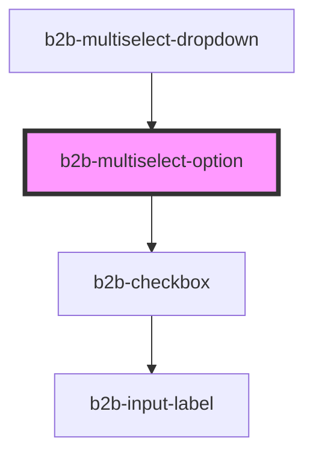

# b2b-multiselect-option

<!-- Auto Generated Below -->

## Properties

| Property              | Attribute  | Description                                     | Type      | Default     |
| --------------------- | ---------- | ----------------------------------------------- | --------- | ----------- |
| `label`               | `label`    | Will provide the label instead of option if set | `string`  | `undefined` |
| `option` _(required)_ | `option`   | The label and value of the option.              | `string`  | `undefined` |
| `selected`            | `selected` | Whether the option is currently selected.       | `boolean` | `false`     |

## Events

| Event                 | Description                                                  | Type                                        |
| --------------------- | ------------------------------------------------------------ | ------------------------------------------- |
| `b2b-option-selected` | Emits the option as a string whenever an option is selected. | `CustomEvent<MultiSelectOptionEventDetail>` |

## Dependencies

### Used by

 - [b2b-multiselect-dropdown](..)

### Depends on

- [b2b-checkbox](../../checkbox)

### Graph

----------------------------------------------

*Built with [StencilJS](https://stenciljs.com/)*
