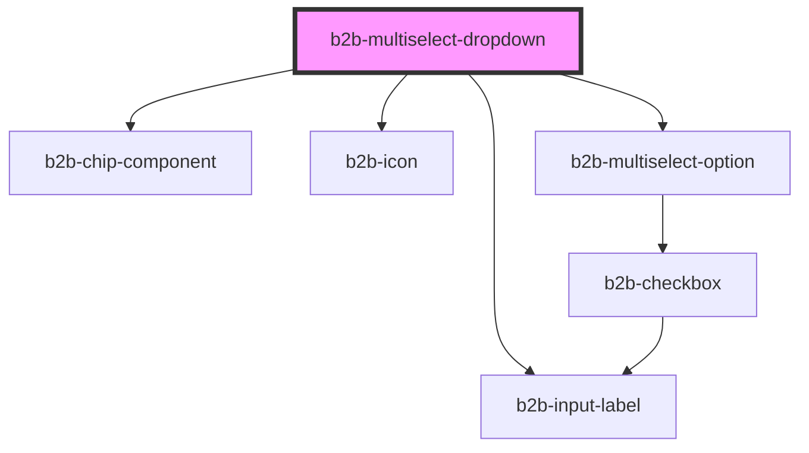

# b2b-multiselect-dropdown

<!-- Auto Generated Below -->

## Properties

| Property             | Attribute             | Description                                                                                                                                 | Type       | Default     |
| -------------------- | --------------------- | ------------------------------------------------------------------------------------------------------------------------------------------- | ---------- | ----------- |
| `label` _(required)_ | `label`               | The input label.                                                                                                                            | `string`   | `undefined` |
| `maxOptionsVisible`  | `max-options-visible` | The maximum amount of chips visible. Adjust this depending on available size of the dropdown.                                               | `number`   | `8`         |
| `optionsList`        | --                    | The list of options passed into the search dropdown. Can be static or dynamic, i.e. updated when the b2b-search or b2b-input emitters fire. | `string[]` | `[]`        |
| `placeholder`        | `placeholder`         | The placeholder shown in the input field.                                                                                                   | `string`   | `undefined` |
| `searchPlaceholder`  | `search-placeholder`  | The placeholder shown in the search bar.                                                                                                    | `string`   | `undefined` |
| `selectAllLabel`     | `select-all-label`    | The string displayed as the select all label.                                                                                               | `string`   | `undefined` |
| `selectedValues`     | --                    | The initial values to be selected in the dropdown.                                                                                          | `string[]` | `[]`        |

## Events

| Event          | Description                                                    | Type                    |
| -------------- | -------------------------------------------------------------- | ----------------------- |
| `b2b-selected` | Emits when there is a change to the currently selected values. | `CustomEvent<string[]>` |

## Dependencies

### Depends on

- [b2b-chip-component](../chip)
- [b2b-input-label](../input-label)
- [b2b-icon](../icon)
- [b2b-multiselect-option](multiselect-option)

### Graph

----------------------------------------------

*Built with [StencilJS](https://stenciljs.com/)*
