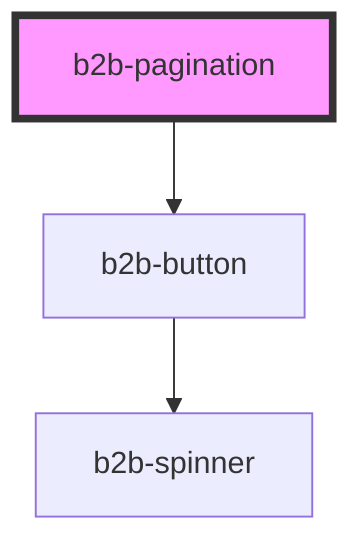

# b2b-pagination

<!-- Auto Generated Below -->

## Properties

| Property                | Attribute                  | Description                                                               | Type     | Default                 |
| ----------------------- | -------------------------- | ------------------------------------------------------------------------- | -------- | ----------------------- |
| `activePage`            | `active-page`              | Use this property to set programmatically the active page                 | `number` | `1`                     |
| `ariaLabelNextPage`     | `aria-label-next-page`     | (optional) translation to 'Go to next page'                               | `string` | `'Go to next page'`     |
| `ariaLabelPreviousPage` | `aria-label-previous-page` | (optional) translation to 'Go to previous page'                           | `string` | `'Go to previous page'` |
| `totalPages`            | `total-pages`              | The total number of pages to calculate the length of pagination component | `number` | `1`                     |

## Events

| Event             | Description                                                                                                                                                                                                                | Type                                 |
| ----------------- | -------------------------------------------------------------------------------------------------------------------------------------------------------------------------------------------------------------------------- | ------------------------------------ |
| `b2b-page-change` | Will emit every time a page changes, by clicking back, next or any specific page. \ Emits a PageChangeEventDetail that includes lastSelectedPage, currentPage and direction. Direction is only when clicking back or next. | `CustomEvent<PageChangeEventDetail>` |

## Dependencies

### Depends on

- [b2b-button](../button)

### Graph

----------------------------------------------

*Built with [StencilJS](https://stenciljs.com/)*
