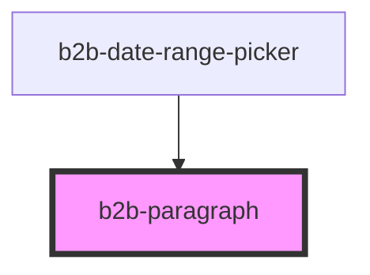

# b2b-paragraph

<!-- Auto Generated Below -->

## Overview

Paragraph component to render text content.
Initial story: https://otto-eg.atlassian.net/browse/B2BDS-45

## Properties

| Property  | Attribute | Description                                                                           | Type                                    | Default       |
| --------- | --------- | ------------------------------------------------------------------------------------- | --------------------------------------- | ------------- |
| `align`   | `align`   | The alignment of the text.                                                            | `"center" \| "left" \| "right"`         | `'left'`      |
| `display` | `display` | The positioning of the paragraph in the page flow. Defaults to native block behavior. | `"block" \| "inline" \| "inline-block"` | `'block'`     |
| `margin`  | `margin`  | Whether or not the paragraph has a bottom margin. Defaults to true.                   | `boolean`                               | `true`        |
| `size`    | `size`    | The size of the text.                                                                 | `"100" \| "50"`                         | `'100'`       |
| `variant` | `variant` | The color of the paragraph. Defaults to black.                                        | `"black-100" \| "grey-400"`             | `'black-100'` |
| `weight`  | `weight`  | The weight of the text.                                                               | `"bold" \| "normal"`                    | `'normal'`    |

## Dependencies

### Used by

 - [b2b-date-range-picker](../date-range-picker)

### Graph

----------------------------------------------

*Built with [StencilJS](https://stenciljs.com/)*
