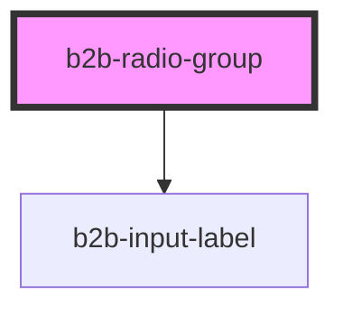

# b2b-radio-group

<!-- Auto Generated Below -->

## Properties

| Property            | Attribute   | Description                                                                                                             | Type                         | Default      |
| ------------------- | ----------- | ----------------------------------------------------------------------------------------------------------------------- | ---------------------------- | ------------ |
| `alignment`         | `alignment` | The alignment of the radio group. Can be vertical or horizontal, per default it is vertical.                            | `"horizontal" \| "vertical"` | `'vertical'` |
| `disabled`          | `disabled`  | Whether or not the radio group is disabled as a whole. Per default it is false.                                         | `boolean`                    | `false`      |
| `error`             | `error`     | A group error text. It will only show if invalid is set to true.                                                        | `string`                     | `undefined`  |
| `hint`              | `hint`      | A group hint text.                                                                                                      | `string`                     | `undefined`  |
| `invalid`           | `invalid`   | Whether or not the radio group is invalid and should be rendered with error styles as a whole. Per default it is false. | `boolean`                    | `false`      |
| `label`             | `label`     | The radio group label. This is optional.                                                                                | `string`                     | `undefined`  |
| `name` _(required)_ | `name`      | The radio group name used to group them together programmatically. This is required.                                    | `string`                     | `undefined`  |
| `required`          | `required`  | Adds an asterisk at the end of the label to signify that the field is required.                                         | `boolean`                    | `false`      |

## Events

| Event              | Description                                                                                                          | Type                                 |
| ------------------ | -------------------------------------------------------------------------------------------------------------------- | ------------------------------------ |
| `b2b-group-change` | Emitted whenever a radio button in the group is clicked. Will emit the value of the currently selected radio button. | `CustomEvent<RadioEventDetail<any>>` |

## Dependencies

### Depends on

- [b2b-input-label](../input-label)

### Graph

----------------------------------------------

*Built with [StencilJS](https://stenciljs.com/)*
