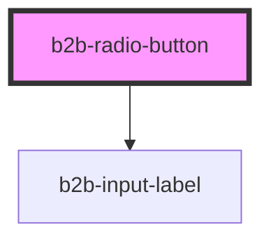

# b2b-radio-button

<!-- Auto Generated Below -->

## Properties

| Property             | Attribute  | Description                                                                                                                                                | Type      | Default     |
| -------------------- | ---------- | ---------------------------------------------------------------------------------------------------------------------------------------------------------- | --------- | ----------- |
| `checked`            | `checked`  | Whether or not the radio button is currently checked. Per default it is false.                                                                             | `boolean` | `false`     |
| `disabled`           | `disabled` | Whether or not the radio button is currently disabled. Per default it is false.                                                                            | `boolean` | `false`     |
| `error`              | `error`    | An error text. It will only show if invalid is set to true.                                                                                                | `string`  | `undefined` |
| `hint`               | `hint`     | A hint to give additional information on the radio button.                                                                                                 | `string`  | `undefined` |
| `invalid`            | `invalid`  | Whether or not the radio button should be rendered with error styles. Per default it is false.                                                             | `boolean` | `false`     |
| `label` _(required)_ | `label`    | The label of the radio button. This is required                                                                                                            | `string`  | `undefined` |
| `name` _(required)_  | `name`     | The name of the radio button. Use it to group radio buttons together and assign the label to the input element for better accessibility. This is required. | `string`  | `undefined` |
| `required`           | `required` | Adds an asterisk at the end of the label to signify that the field is required.                                                                            | `boolean` | `false`     |
| `value`              | `value`    | The value of the radio button. This will be emitted when the radio button is clicked.                                                                      | `string`  | `undefined` |

## Events

| Event        | Description                                     | Type                                 |
| ------------ | ----------------------------------------------- | ------------------------------------ |
| `b2b-blur`   | Emits whenever the radio button loses focus.    | `CustomEvent<FocusEvent>`            |
| `b2b-change` | Emitted whenever the radio button is clicked.   | `CustomEvent<RadioEventDetail<any>>` |
| `b2b-focus`  | Emits whenever the radio button receives focus. | `CustomEvent<FocusEvent>`            |

## Dependencies

### Depends on

- [b2b-input-label](../input-label)

### Graph

----------------------------------------------

*Built with [StencilJS](https://stenciljs.com/)*
