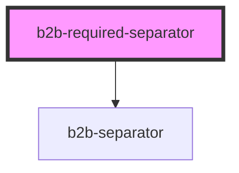

# b2b-required-separator

<!-- Auto Generated Below -->

## Properties

| Property | Attribute | Description                                                                         | Type     | Default         |
| -------- | --------- | ----------------------------------------------------------------------------------- | -------- | --------------- |
| `label`  | `label`   | The required label. Per default it is the german 'Pflichtfeld', but can be altered. | `string` | `'Pflichtfeld'` |

## Dependencies

### Depends on

- [b2b-separator](../separator)

### Graph

----------------------------------------------

*Built with [StencilJS](https://stenciljs.com/)*
