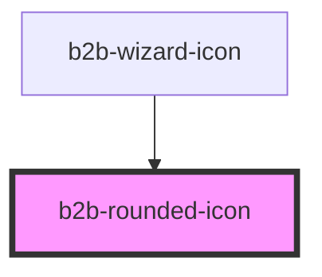

# b2b-alert

<!-- Auto Generated Below -->

## Properties

| Property       | Attribute       | Description                                                                                                                                                | Type     | Default                           |
| -------------- | --------------- | ---------------------------------------------------------------------------------------------------------------------------------------------------------- | -------- | --------------------------------- |
| `borderColor`  | `border-color`  | The color of the border of the circle around the icon or text. Use any type including hex, rgb or css custom properties as long as you pass it as a string | `string` | `undefined`                       |
| `color`        | `color`         | The color of the circle around the icon or text. Use any type including hex, rgb or css custom properties as long as you pass it as a string               | `string` | `'var(--b2b-color-info-50)'`      |
| `contentColor` | `content-color` | The color of the text or icon within the circle. Use any type including hex, rgb or css custom properties as long as you pass it as a string               | `string` | `'var(--b2b-color-copy-default)'` |

## Dependencies

### Used by

 - [b2b-wizard-icon](../wizard-icon)

### Graph

----------------------------------------------

*Built with [StencilJS](https://stenciljs.com/)*
