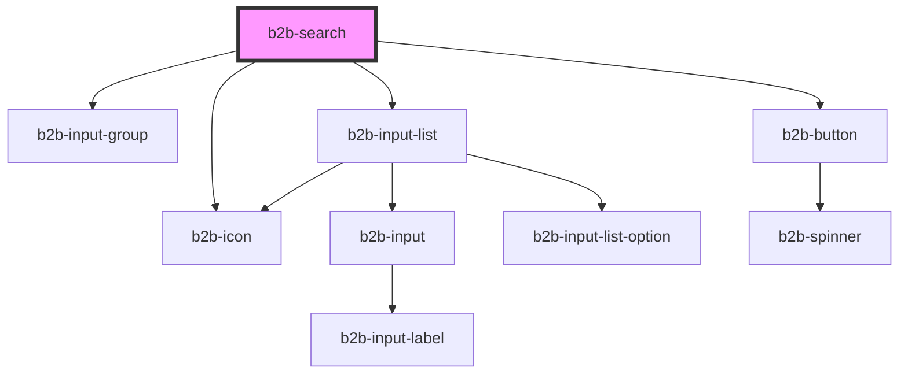

# b2b-search

<!-- Auto Generated Below -->

## Properties

| Property      | Attribute     | Description                                                                                                                                 | Type       | Default     |
| ------------- | ------------- | ------------------------------------------------------------------------------------------------------------------------------------------- | ---------- | ----------- |
| `optionsList` | --            | The list of options passed into the search dropdown. Can be static or dynamic, i.e. updated when the b2b-search or b2b-input emitters fire. | `string[]` | `[]`        |
| `placeholder` | `placeholder` | The placeholder shown in the input field.                                                                                                   | `string`   | `undefined` |
| `value`       | `value`       | The default value of the search input field. If defined, it will prefill the input.                                                         | `string`   | `null`      |

## Events

| Event        | Description                                                                    | Type                                       |
| ------------ | ------------------------------------------------------------------------------ | ------------------------------------------ |
| `b2b-search` | Emits whenever the user clicks the search button. Will emit the search string. | `CustomEvent<SearchClickEventDetail<any>>` |

## Dependencies

### Depends on

- [b2b-input-group](../input-group)
- [b2b-input-list](../input-list)
- [b2b-button](../button)
- [b2b-icon](../icon)

### Graph

----------------------------------------------

*Built with [StencilJS](https://stenciljs.com/)*
