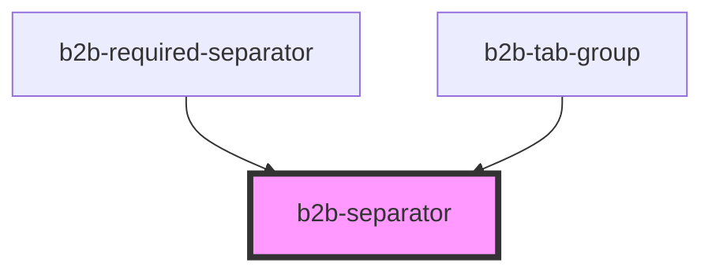

# b2b-separator

<!-- Auto Generated Below -->

## Properties

| Property    | Attribute   | Description                                                   | Type                         | Default        |
| ----------- | ----------- | ------------------------------------------------------------- | ---------------------------- | -------------- |
| `alignment` | `alignment` | The alignment of the separator. Per default it is horizontal. | `"horizontal" \| "vertical"` | `'horizontal'` |

## Dependencies

### Used by

 - [b2b-required-separator](../required-separator)
 - [b2b-tab-group](../tab-group)

### Graph

----------------------------------------------

*Built with [StencilJS](https://stenciljs.com/)*
