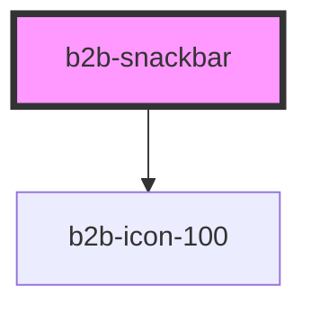

# b2b-snackbar

<!-- Auto Generated Below -->

## Properties

| Property         | Attribute          | Description                                                                                  | Type                                          | Default     |
| ---------------- | ------------------ | -------------------------------------------------------------------------------------------- | --------------------------------------------- | ----------- |
| `actionLabel`    | `action-label`     | Text for the Call-to-Action link.                                                            | `string`                                      | `undefined` |
| `description`    | `description`      | Text on the snackbar.                                                                        | `string`                                      | `undefined` |
| `duration`       | `duration`         | How long is snackbar shown. Default value is 5000 ms.                                        | `number`                                      | `5000`      |
| `hasAction`      | `has-action`       | Whether the snackbar has a Call-to-Action. Per default, it is false.                         | `boolean`                                     | `false`     |
| `hasCloseButton` | `has-close-button` | Whether the snackbar has a close button. Per default, it is true.                            | `boolean`                                     | `true`      |
| `isUnderlined`   | `is-underlined`    | Whether the description is underlined. If false, then it is bold.                            | `boolean`                                     | `false`     |
| `opened`         | `opened`           | Whether the snackbar is currently visible. Set to true to display the snackbar.              | `boolean`                                     | `false`     |
| `timed`          | `timed`            | Whether snackbar is show for limited time. Default is true. Error snackbars cannot be timed. | `boolean`                                     | `true`      |
| `type`           | `type`             | The type of snackbar. Default is info.                                                       | `"error" \| "info" \| "success" \| "warning"` | `'info'`    |

## Events

| Event              | Description                            | Type                |
| ------------------ | -------------------------------------- | ------------------- |
| `b2b-action-click` | Emits whenever the CTA is clicked.     | `CustomEvent<void>` |
| `b2b-close`        | Emits whenever the snackbar is closed. | `CustomEvent<void>` |

## Dependencies

### Depends on

- [b2b-icon-100](../icon-100)

### Graph

----------------------------------------------

*Built with [StencilJS](https://stenciljs.com/)*
