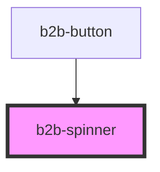

# b2b-spinner

<!-- Auto Generated Below -->

## Overview

Spinner component to display loading indicator.
Initial story: https://otto-eg.atlassian.net/browse/B2BDS-70

## Properties

| Property | Attribute | Description               | Type                                    | Default     |
| -------- | --------- | ------------------------- | --------------------------------------- | ----------- |
| `color`  | `color`   | The color of the spinner. | `"inverse" \| "primary" \| "secondary"` | `'primary'` |
| `size`   | `size`    | The size of the spinner.  | `"100" \| "200" \| "50"`                | `'100'`     |

## Dependencies

### Used by

 - [b2b-button](../button)

### Graph

----------------------------------------------

*Built with [StencilJS](https://stenciljs.com/)*
