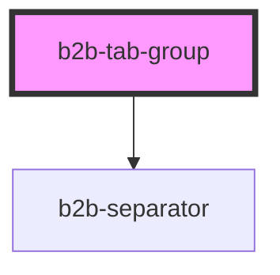

# b2b-tab-group

<!-- Auto Generated Below -->

## Properties

| Property    | Attribute    | Description                                                                                                                                                                | Type      | Default |
| ----------- | ------------ | -------------------------------------------------------------------------------------------------------------------------------------------------------------------------- | --------- | ------- |
| `useRouter` | `use-router` | Determines if the Tab Group will do it's own navigation. Per default, it will use internal navigation. Set it to true if you want to use external, route-based navigation. | `boolean` | `false` |

## Events

| Event          | Description                                                                 | Type                                |
| -------------- | --------------------------------------------------------------------------- | ----------------------------------- |
| `b2b-selected` | Emits the previous and the next tab panel whenever a new panel is selected. | `CustomEvent<TabChangeEventDetail>` |

## Dependencies

### Depends on

- [b2b-separator](../separator)

### Graph

----------------------------------------------

*Built with [StencilJS](https://stenciljs.com/)*
