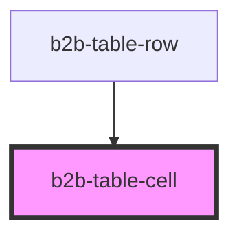

# b2b-table-cell

<!-- Auto Generated Below -->

## Properties

| Property   | Attribute   | Description                                                                                                                                                                     | Type                                 | Default                 |
| ---------- | ----------- | ------------------------------------------------------------------------------------------------------------------------------------------------------------------------------- | ------------------------------------ | ----------------------- |
| `align`    | `align`     | Alignment of the content of the cell, by default is to the left. *                                                                                                              | `"center" \| "left" \| "right"`      | `ContentAlignment.LEFT` |
| `color`    | `color`     | Background color of the cell. This color selection does not have hover states, as it is handled from the row*                                                                   | `"default" \| "group" \| "selected"` | `'default'`             |
| `colspan`  | `colspan`   |                                                                                                                                                                                 | `string`                             | `undefined`             |
| `divider`  | `divider`   | adds a border to the right of the cell. *                                                                                                                                       | `boolean`                            | `false`                 |
| `size`     | `size`      | The size of the cell. Follows table size. When size is equal and textWrap is false, the text will truncate with Ellipsis. Other sizes won't affect cell current implementation. | `"equal" \| "expand"`                | `TableSizes.EXPAND`     |
| `textWrap` | `text-wrap` | Whether text should wrap or truncate. It will only truncate when table size is equal *                                                                                          | `boolean`                            | `true`                  |

## Dependencies

### Used by

 - [b2b-table-row](../table-row)

### Graph

----------------------------------------------

*Built with [StencilJS](https://stenciljs.com/)*
