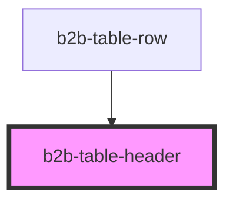

# b2b-table-header

<!-- Auto Generated Below -->

## Properties

| Property        | Attribute        | Description                                                                                                                                                                            | Type                                          | Default                 |
| --------------- | ---------------- | -------------------------------------------------------------------------------------------------------------------------------------------------------------------------------------- | --------------------------------------------- | ----------------------- |
| `colspan`       | `colspan`        | The width of the column. Increase it to change the size of the column relative to other columns.                                                                                       | `number`                                      | `undefined`             |
| `contentAlign`  | `content-align`  | Alignment of the content of the cell, by default is to the left. *                                                                                                                     | `"center" \| "left" \| "right"`               | `ContentAlignment.LEFT` |
| `divider`       | `divider`        | adds a border to the right of the header. *                                                                                                                                            | `boolean`                                     | `false`                 |
| `fixed`         | `fixed`          | **[DEPRECATED]** Use fixed on the rowgroup instead. Sets the header position to sticky. Use it when table is inside a scrollable container. *   | `boolean`                                     | `false`                 |
| `size`          | `size`           | The size of the cell. Follows table size. When size is equal and textWrap is false, the text will truncate with Ellipsis. Other sizes won't affect cell current implementation.        | `"colspan" \| "equal" \| "expand"`            | `TableSizes.EXPAND`     |
| `sortDirection` | `sort-direction` | The direction in which the column data is sorted. Per default, it is unsorted and no button is visible. If your data comes presorted, you need to adjust this.                         | `"ascending" \| "descending" \| "not-sorted"` | `undefined`             |
| `sortId`        | `sort-id`        | Optional string to uniquely represent the header, this id will be emitted by the table b2b-sort-change event. If not provided, the event will emit the header textContent.             | `string`                                      | `undefined`             |

## Events

| Event        | Description                                | Type                                                       |
| ------------ | ------------------------------------------ | ---------------------------------------------------------- |
| `b2b-change` | Emits whenever the sort direction changes. | `CustomEvent<"ascending" \| "descending" \| "not-sorted">` |

## Dependencies

### Used by

 - [b2b-table-row](../table-row)

### Graph

----------------------------------------------

*Built with [StencilJS](https://stenciljs.com/)*
