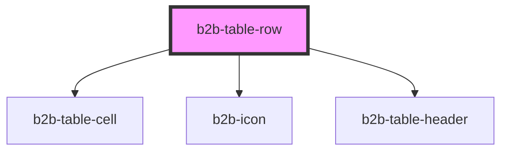

# b2b-table-row

<!-- Auto Generated Below -->

## Properties

| Property    | Attribute   | Description                                                                                | Type                                 | Default     |
| ----------- | ----------- | ------------------------------------------------------------------------------------------ | ------------------------------------ | ----------- |
| `color`     | `color`     | Background color of the row. Use it semantically. This color selection have hover states * | `"default" \| "group" \| "selected"` | `'default'` |
| `highlight` | `highlight` | Whether the row will be highlighted on mouse over *                                        | `boolean`                            | `true`      |
| `type`      | `type`      | Determined by the parent rowgroup for accordion rowgroups. Do not set manually.            | `"child" \| "header" \| "parent"`    | `undefined` |

## Events

| Event      | Description                                                                                                                        | Type                   |
| ---------- | ---------------------------------------------------------------------------------------------------------------------------------- | ---------------------- |
| `b2b-open` | Emits if the parent rowgroup is an accordion and the row is a top-level accordion row. Determines if the child rows will be shown. | `CustomEvent<boolean>` |

## Methods

### `toggleAccordion(isOpen: any) => Promise<void>`

#### Returns

Type: `Promise<void>`

## Dependencies

### Depends on

- [b2b-table-cell](../table-cell)
- [b2b-icon](../../icon)
- [b2b-table-header](../table-header)

### Graph

----------------------------------------------

*Built with [StencilJS](https://stenciljs.com/)*
