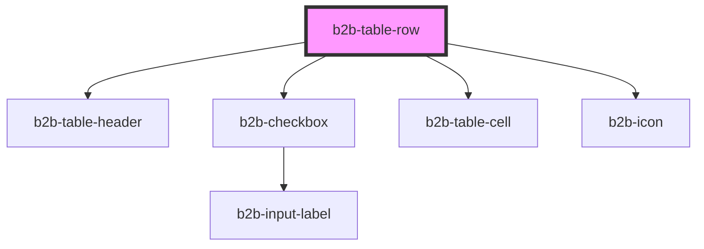

# b2b-table-row

<!-- Auto Generated Below -->

## Properties

| Property        | Attribute       | Description                                                                                                                     | Type                                 | Default     |
| --------------- | --------------- | ------------------------------------------------------------------------------------------------------------------------------- | ------------------------------------ | ----------- |
| `checked`       | `checked`       | If a selectable row is currently checked. Per default, it is false.                                                             | `boolean`                            | `false`     |
| `color`         | `color`         | Background color of the row. Use it semantically. This color selection have hover states *                                      | `"default" \| "group" \| "selected"` | `'default'` |
| `highlight`     | `highlight`     | Whether the row will be highlighted on mouse over *                                                                             | `boolean`                            | `true`      |
| `indeterminate` | `indeterminate` | If a selectable row is a parent for an accordion, it becomes indeterminate when some of it's children are checked, but not all. | `boolean`                            | `false`     |
| `value`         | `value`         | The unique identifier for a selectable row. It is emitted when the row is selected.                                             | `string`                             | `undefined` |

## Events

| Event              | Description                                                                                                                        | Type                                    |
| ------------------ | ---------------------------------------------------------------------------------------------------------------------------------- | --------------------------------------- |
| `b2b-open`         | Emits if the parent rowgroup is an accordion and the row is a top-level accordion row. Determines if the child rows will be shown. | `CustomEvent<boolean>`                  |
| `b2b-row-selected` | Emits if the row is selectable and it is selected or unselected. Emits both unique value and the checkbox status.                  | `CustomEvent<CheckboxEventDetail<any>>` |

## Methods

### `toggleAccordion(isOpen: boolean) => Promise<void>`

Will toggle the accordion opened or closed.

#### Parameters

| Name     | Type      | Description |
| -------- | --------- | ----------- |
| `isOpen` | `boolean` |             |

#### Returns

Type: `Promise<void>`

## Dependencies

### Depends on

- [b2b-table-header](../table-header)
- [b2b-checkbox](../../checkbox)
- [b2b-table-cell](../table-cell)
- [b2b-icon](../../icon)

### Graph

----------------------------------------------

*Built with [StencilJS](https://stenciljs.com/)*
