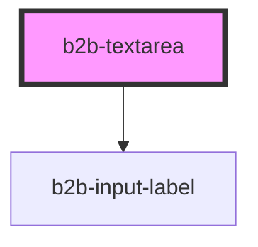

# b2b-textarea

<!-- Auto Generated Below -->

## Overview

Text Area Component
Initial story: https://otto-eg.atlassian.net/browse/B2BDS-96

## Properties

| Property      | Attribute       | Description                                                                                            | Type                                              | Default     |
| ------------- | --------------- | ------------------------------------------------------------------------------------------------------ | ------------------------------------------------- | ----------- |
| `disabled`    | `disabled`      | Whether or not the textarea is disabled. Per default it is false.                                      | `boolean`                                         | `false`     |
| `error`       | `error`         | An optional error message that is displayed when the textarea is invalid. Per default it is undefined. | `string`                                          | `undefined` |
| `focusOnLoad` | `focus-on-load` | Whether or not the textarea should be automatically focused on page load. Per default it is false.     | `boolean`                                         | `false`     |
| `height`      | `height`        | The height of the text area                                                                            | `string`                                          | `''`        |
| `hint`        | `hint`          | An optional hint for the textarea. Per default it is undefined.                                        | `string`                                          | `undefined` |
| `invalid`     | `invalid`       | Whether or not the textarea should be displayed with error styles. Per default it is false.            | `boolean`                                         | `false`     |
| `label`       | `label`         | The textarea label. This is optional.                                                                  | `string`                                          | `undefined` |
| `maxLength`   | `max-length`    | The maximum input length. Characters entered after that will not be appended to the input value.       | `number`                                          | `undefined` |
| `name`        | `name`          | The name of the textarea. This is used to programmatically group it into a form.                       | `string`                                          | `undefined` |
| `placeholder` | `placeholder`   | The textarea placeholder. It is optional and undefined by default.                                     | `string`                                          | `undefined` |
| `required`    | `required`      | Adds an asterisk at the end of the label to signify that the field is required.                        | `boolean`                                         | `false`     |
| `resize`      | `resize`        | If and how the textarea is resizable. Per default it is resizable in both directions.                  | `"horizontal" \| "none" \| "unset" \| "vertical"` | `undefined` |
| `value`       | `value`         | The value of the textarea. Per default it is null.                                                     | `string`                                          | `null`      |

## Events

| Event       | Description                                  | Type                            |
| ----------- | -------------------------------------------- | ------------------------------- |
| `b2b-blur`  | Emits whenever the textarea loses focus.     | `CustomEvent<FocusEvent>`       |
| `b2b-focus` | Emits whenever the textarea receives focus.  | `CustomEvent<FocusEvent>`       |
| `b2b-input` | Emits whenever the textarea's input changes. | `CustomEvent<InputChangeEvent>` |

## Dependencies

### Depends on

- [b2b-input-label](../input-label)

### Graph

----------------------------------------------

*Built with [StencilJS](https://stenciljs.com/)*
