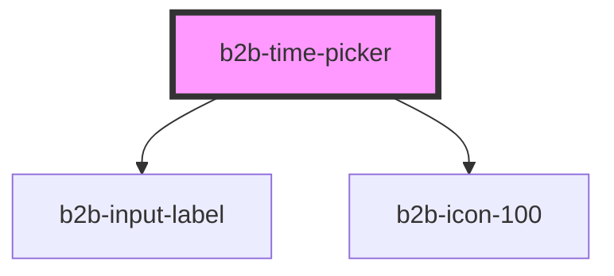

# b2b-time-picker

<!-- Auto Generated Below -->

## Properties

| Property      | Attribute     | Description                                                                                                                     | Type      | Default     |
| ------------- | ------------- | ------------------------------------------------------------------------------------------------------------------------------- | --------- | ----------- |
| `error`       | `error`       | The error message that is shown if the input is invalid.                                                                        | `string`  | `undefined` |
| `hint`        | `hint`        | The hint text that appears underneath the time picker field.                                                                    | `string`  | `undefined` |
| `interval`    | `interval`    | The interval in minutes for the time options. Default is 15 minutes.                                                            | `number`  | `15`        |
| `invalid`     | `invalid`     | Whether the time picker is currently invalid. If true, the time picker is rendered with error styles. Per default, it is false. | `boolean` | `false`     |
| `label`       | `label`       | The time picker label.                                                                                                          | `string`  | `undefined` |
| `placeholder` | `placeholder` | The placeholder for the time picker input field.                                                                                | `string`  | `'hh:mm'`   |
| `required`    | `required`    | Adds an asterisk at the end of the label to signify that the field is required.                                                 | `boolean` | `false`     |
| `value`       | `value`       | The value of the time picker. It has to be in the format "hh:mm".                                                               | `string`  | `null`      |

## Events

| Event          | Description                                          | Type                            |
| -------------- | ---------------------------------------------------- | ------------------------------- |
| `b2b-blur`     | Emits whenever the time picker loses focus.          | `CustomEvent<FocusEvent>`       |
| `b2b-clear`    | Emits when the user clicks the clear button.         | `CustomEvent<DateClear<any>>`   |
| `b2b-focus`    | Emits whenever the time picker receives focus.       | `CustomEvent<FocusEvent>`       |
| `b2b-input`    | Emits whenever the input value changes.              | `CustomEvent<InputChangeEvent>` |
| `b2b-selected` | Emits whenever a time is selected from the dropdown. | `CustomEvent<string>`           |

## Dependencies

### Depends on

- [b2b-input-label](../input-label)
- [b2b-icon-100](../icon-100)

### Graph

----------------------------------------------

*Built with [StencilJS](https://stenciljs.com/)*
