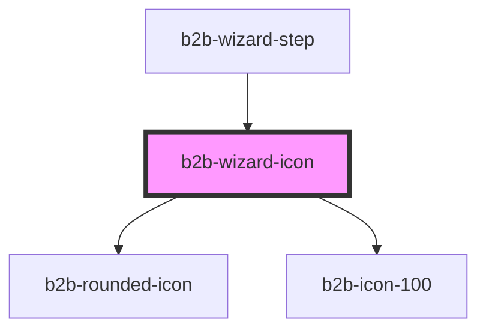

# b2b-wizard-icon

<!-- Auto Generated Below -->

## Properties

| Property    | Attribute    | Description                                                                                                    | Type                                                  | Default                |
| ----------- | ------------ | -------------------------------------------------------------------------------------------------------------- | ----------------------------------------------------- | ---------------------- |
| `checkIcon` | `check-icon` | Defaults to true. It will show a checkmark icon when a step is completed. Set as false to show the step number | `boolean`                                             | `true`                 |
| `state`     | `state`      | The state of the step                                                                                          | `"completed" \| "default" \| "disabled" \| "pending"` | `WizardStatus.PENDING` |
| `step`      | `step`       | The step number                                                                                                | `"1" \| "2" \| "3" \| "4" \| "5" \| "6"`              | `undefined`            |

## Dependencies

### Used by

 - [b2b-wizard-step](../wizard)

### Depends on

- [b2b-rounded-icon](../rounded-icon)
- [b2b-icon-100](../icon-100)

### Graph

----------------------------------------------

*Built with [StencilJS](https://stenciljs.com/)*
