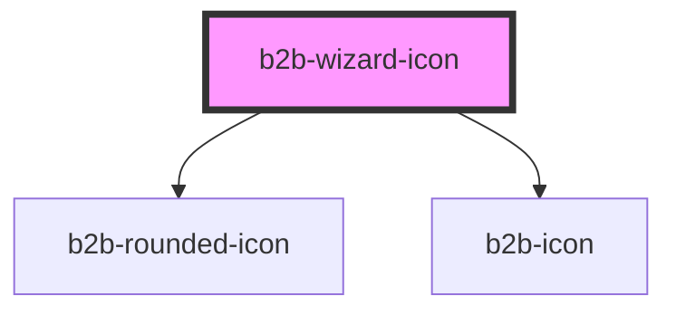

# b2b-wizard-icon

<!-- Auto Generated Below -->

## Properties

| Property | Attribute | Description           | Type                                     | Default     |
| -------- | --------- | --------------------- | ---------------------------------------- | ----------- |
| `state`  | `state`   | The state of the step | `"completed" \| "disabled" \| "pending"` | `'pending'` |
| `step`   | `step`    | The step number       | `"1" \| "2" \| "3" \| "4" \| "5" \| "6"` | `undefined` |

## Dependencies

### Depends on

- [b2b-rounded-icon](../rounded-icon)
- [b2b-icon](../icon)

### Graph

----------------------------------------------

*Built with [StencilJS](https://stenciljs.com/)*
