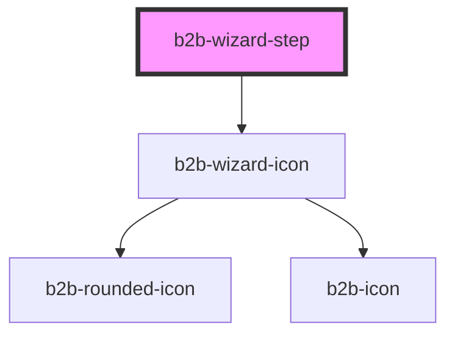

# b2b-stepper

<!-- Auto Generated Below -->

## Properties

| Property    | Attribute    | Description                                                                                                    | Type                                                  | Default     |
| ----------- | ------------ | -------------------------------------------------------------------------------------------------------------- | ----------------------------------------------------- | ----------- |
| `checkIcon` | `check-icon` | Defaults to true. It will show a checkmark icon when a step is completed. Set as false to show the step number | `boolean`                                             | `true`      |
| `label`     | `label`      | The label of the step                                                                                          | `string`                                              | `'Step'`    |
| `state`     | `state`      | Use when wizard has property custom true. The state of the step                                                | `"completed" \| "default" \| "disabled" \| "pending"` | `'pending'` |
| `step`      | `step`       | Use when wizard has property custom true. The step number                                                      | `"1" \| "2" \| "3" \| "4" \| "5" \| "6"`              | `'1'`       |

## Dependencies

### Depends on

- [b2b-wizard-icon](../wizard-icon)

### Graph

----------------------------------------------

*Built with [StencilJS](https://stenciljs.com/)*
